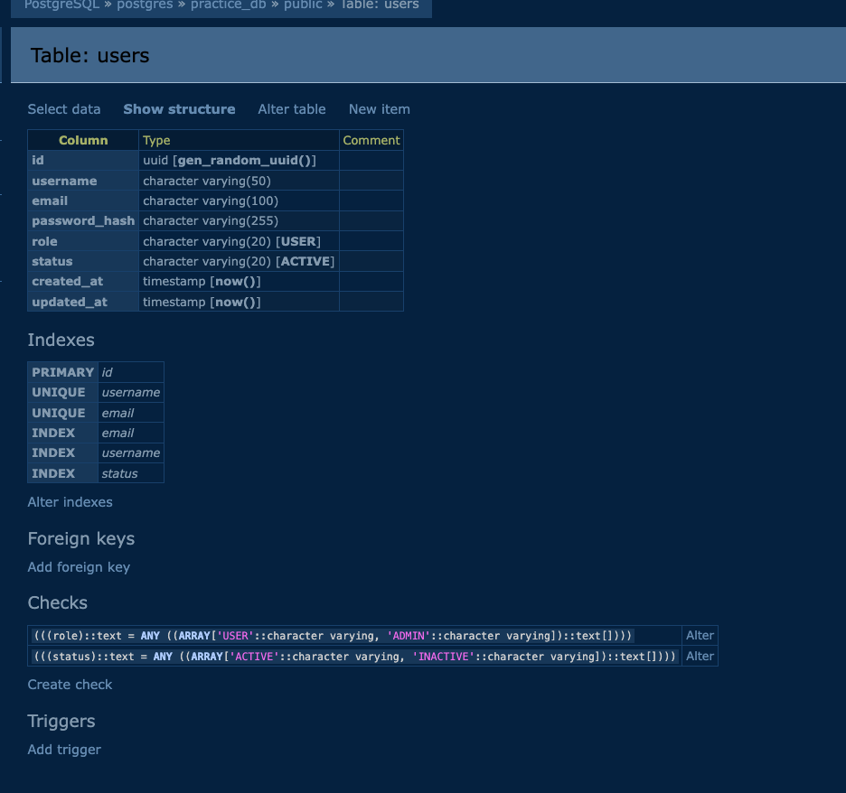
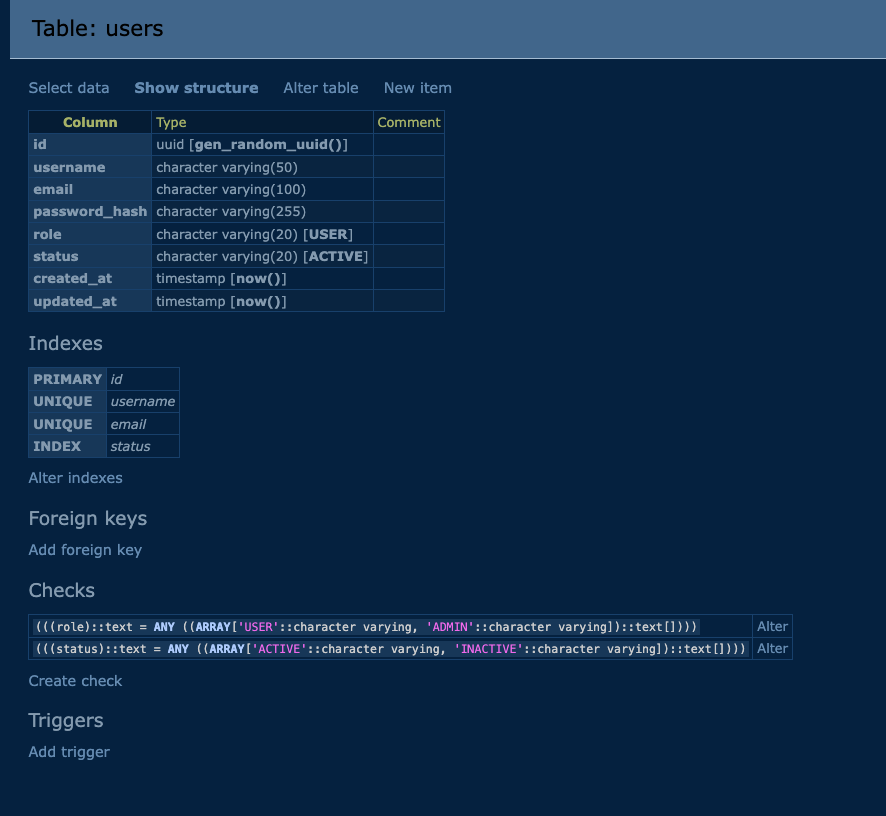

# Duplicate Index — Phân tích và Fix

## Vấn đề phát hiện

Trong migration `V20260313100000__create_users_table.sql`, cột `email` và `username`
có cả UNIQUE constraint lẫn CREATE INDEX riêng — tạo ra 2 index giống nhau trên mỗi cột.

```sql
-- UNIQUE constraint → PostgreSQL tự tạo ngầm B-tree index
CONSTRAINT uq_users_username UNIQUE (username),
CONSTRAINT uq_users_email    UNIQUE (email),

-- CREATE INDEX thêm vào → index thứ 2, hoàn toàn trùng
CREATE INDEX IF NOT EXISTS idx_users_email    ON users (email);    ← THỪA
CREATE INDEX IF NOT EXISTS idx_users_username ON users (username); ← THỪA
```

---

## Tại sao nguy hiểm?

UNIQUE constraint trong PostgreSQL tự tạo B-tree index bên dưới để enforce uniqueness.
`CREATE INDEX` thêm vào là index thứ 2 hoàn toàn giống — không mang lại lợi ích gì thêm.

Hậu quả:
- Mỗi INSERT / UPDATE phải maintain cả 2 index → tốn CPU gấp đôi cho email và username
- Tốn gấp đôi storage cho 2 index giống nhau
- Query planner phải chọn giữa 2 index giống nhau → không tối ưu

---

## Bằng chứng thực tế (Adminer — trước khi migration)



Phần Indexes trong DB hiển thị rõ duplicate:

```
PRIMARY  id
UNIQUE   username    ← từ UNIQUE constraint
UNIQUE   email       ← từ UNIQUE constraint
INDEX    email       ← từ CREATE INDEX   ← DUPLICATE với dòng trên
INDEX    username    ← từ CREATE INDEX   ← DUPLICATE với dòng trên
INDEX    status
```

Cùng 1 cột `email` có 2 dòng: `UNIQUE email` và `INDEX email`. Tương tự với `username`.

---

## Fix

Tạo migration mới `V20260321100000__drop_duplicate_indexes_users.sql`:

```sql
DROP INDEX IF EXISTS idx_users_email;
DROP INDEX IF EXISTS idx_users_username;
```

Không sửa migration cũ — nguyên tắc Flyway: migration đã deploy không được chỉnh sửa.




---

## Trạng thái index sau fix

```
PRIMARY  id
UNIQUE   username
UNIQUE   email
INDEX    status
```

| Index | Nguồn | Trạng thái |
|---|---|---|
| `uq_users_email` (ngầm từ UNIQUE) | UNIQUE constraint | Giữ |
| `uq_users_username` (ngầm từ UNIQUE) | UNIQUE constraint | Giữ |
| `idx_users_status` | CREATE INDEX | Giữ — không có UNIQUE constraint trên cột này |
| `idx_users_email` | CREATE INDEX | Xóa — duplicate |
| `idx_users_username` | CREATE INDEX | Xóa — duplicate |

---

## Bài học

Khi tạo UNIQUE constraint, không cần CREATE INDEX thêm cho cùng cột đó.
Chỉ dùng CREATE INDEX cho các cột không có UNIQUE constraint (ví dụ: `status`, `created_at`).
